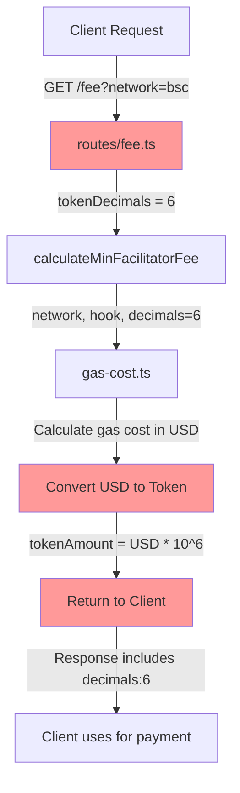
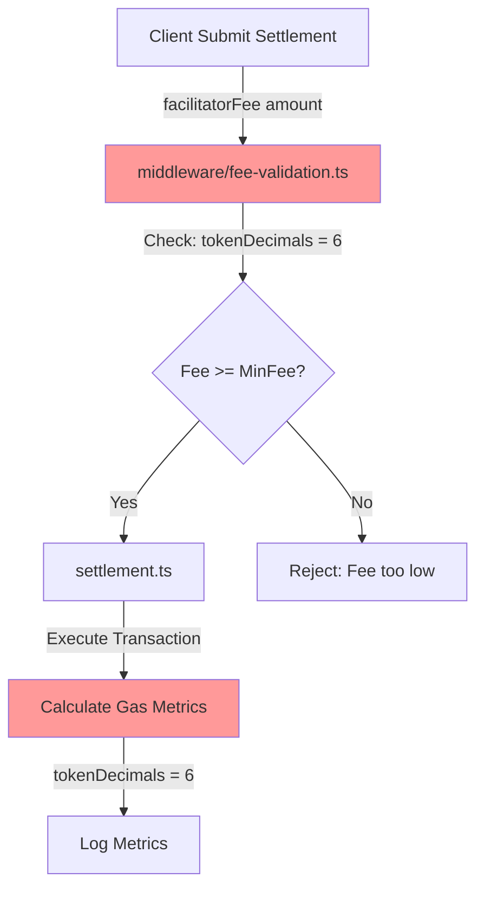

# Facilitator Decimals 影响分析

## 问题概述

Facilitator 中多处**硬编码 `decimals = 6`**，假设所有 token 都是 USDC。如果 BSC 的 Wrapped USDT 实际 decimals 不是 6，会导致多个关键功能失效。

## 硬编码位置汇总

### 1. Settlement 结算（`settlement.ts:526`）

```typescript
// settlement.ts:526
const gasMetrics = calculateGasMetrics(
  receipt,
  extra.facilitatorFee,
  extra.hook,
  network,
  nativePrice.toString(),
  6, // ⚠️ USDC decimals (all current settlements use USDC)
);
```

**用途**: 计算 gas metrics 时转换 facilitator fee

### 2. Fee Route - 费用计算接口（`routes/fee.ts:85`）

```typescript
// routes/fee.ts:85
// Get token decimals (USDC has 6 decimals)
const tokenDecimals = 6; // ⚠️ 硬编码

// Later used in (routes/fee.ts:160)
token: {
  address: networkConfig.defaultAsset.address,
  symbol: "USDC",
  decimals: tokenDecimals, // ⚠️ 返回给客户端
},
```

**用途**: 
- 计算最小 facilitator fee
- 返回给客户端用于显示

### 3. Fee Validation 中间件（`middleware/fee-validation.ts:100`）

```typescript
// middleware/fee-validation.ts:100
// TODO: In future, fetch token decimals dynamically from network config.
const tokenDecimals = 6; // ⚠️ USDC has 6 decimals

// Used for calculating minimum fee
feeCalculation = await calculateMinFacilitatorFee(
  network,
  hook,
  tokenDecimals, // ⚠️ 传入计算函数
  config,
  dynamicConfig,
  tokenPriceConfig,
);
```

**用途**: 验证用户提供的 facilitator fee 是否足够

### 4. Gas Cost 计算（`gas-cost.ts:260-261`）

```typescript
// gas-cost.ts:260-261
export function calculateEffectiveGasLimit(
  facilitatorFee: string,
  gasPrice: string,
  nativeTokenPrice: number,
  config: GasCostConfig,
): number {
  // Convert facilitator fee to USD (assuming 6 decimals for USDC)
  const feeUSD = parseFloat(facilitatorFee) / 1e6; // ⚠️ 硬编码 1e6 = 10^6
  // ...
}
```

**用途**: 将 facilitator fee 从 token 单位转换为 USD

### 5. Gas Metrics 计算（`gas-metrics.ts:59-60, 87`）

```typescript
// gas-metrics.ts:59-60
export function calculateGasMetrics(
  receipt: TransactionReceipt,
  facilitatorFee: string,
  hook: string,
  network: string,
  nativeTokenPriceUSD = "0",
  tokenDecimals = 6, // ⚠️ Default to USDC decimals
): GasMetrics {
  // ...
  
  // gas-metrics.ts:87
  // Calculate facilitator fee in USD using provided token decimals
  const facilitatorFeeUSD = (
    parseFloat(facilitatorFee) / Math.pow(10, tokenDecimals) // ⚠️ 使用传入的 decimals
  ).toFixed(6);
}
```

**用途**: 计算费用指标，转换为 USD 用于监控

### 6. 默认配置（`defaults.ts:177-178`）

```typescript
// defaults.ts:177-178
export const FEE_CLAIM_DEFAULTS = {
  /** Minimum claim amount for USDC (6 decimals, 1 USDC = 1000000) */
  MIN_CLAIM_AMOUNT_USDC: "1000000", // ⚠️ 1 USDC = 1,000,000 (假设 6 decimals)
} as const;
```

**用途**: Fee claim 最小金额配置

## 影响分析

### 影响场景 1: Decimals 不匹配（如实际是 18）

#### 🔴 严重程度：致命

#### 具体影响：

##### A. Fee 计算错误（Fee Route & Validation）

**计算逻辑**:
```typescript
// 假设 gas 需要 $0.50 USD
// 代码计算（假设 decimals=6）:
minFee = 0.50 * 10^6 = 500,000 (以为这是 $0.50)

// 实际（如果 decimals=18）:
500,000 = 0.0000000000005 USD  // 实际只值 0.0000000000005 美元！
```

**后果**:
- ❌ **Facilitator 返回的 minimum fee 错误**，可能是实际需要的 10^12 倍差异
- ❌ **用户支付的 fee 无法覆盖 gas 成本**
- ❌ **Facilitator 亏损执行交易**

**示例**:
```typescript
// 正常情况（decimals=6）
Gas cost: $0.50
Min fee: 500,000 units = $0.50 ✅

// 如果 decimals=18
Gas cost: $0.50
Min fee: 500,000 units = $0.0000000000005 ❌
实际需要: 500,000,000,000,000,000 units = $0.50
差异: 10^12 倍！
```

##### B. Gas Limit 计算错误（calculateEffectiveGasLimit）

**计算逻辑**:
```typescript
// gas-cost.ts:260-261
const feeUSD = parseFloat(facilitatorFee) / 1e6; // ⚠️ 假设 decimals=6

// 例如：用户支付 1,000,000 units
// 如果 decimals=6: feeUSD = $1.00 ✅
// 如果 decimals=18: 实际 feeUSD = $0.000000000001 ❌
```

**后果**:
- ❌ **Gas limit 计算极小**，交易可能因 gas 不足而失败
- ❌ **或者 facilitator 设置过高的 gas limit**，浪费 gas 费用

##### C. Metrics 和监控错误（Gas Metrics）

**计算逻辑**:
```typescript
// gas-metrics.ts:87
const facilitatorFeeUSD = (
  parseFloat(facilitatorFee) / Math.pow(10, tokenDecimals)
).toFixed(6);

// 如果传入错误的 tokenDecimals
facilitatorFeeUSD 值错误 → 监控指标错误
```

**后果**:
- ❌ **监控指标显示错误的费用**
- ❌ **利润/亏损计算错误**
- ❌ **无法准确评估 facilitator 运营状况**
- ⚠️ **告警阈值可能失效**

##### D. Fee Claim 功能错误（Fee Claim）

**配置逻辑**:
```typescript
// defaults.ts:178
MIN_CLAIM_AMOUNT_USDC: "1000000", // 假设这是 1 USDC

// 如果 decimals=18
1,000,000 = 0.000000000001 USD  // 实际只值极少的钱
真实的 1 USD = 1,000,000,000,000,000,000
```

**后果**:
- ❌ **Fee claim 门槛实际变得极低或极高**
- ❌ **可能导致频繁的小额 claim（浪费 gas）**
- ❌ **或者永远无法达到 claim 门槛**

### 影响场景 2: Decimals 匹配但与假设不同（如实际是 6 ✅）

#### ✅ 严重程度：无影响

如果 BSC Wrapped USDT 的 decimals **确实是 6**，则没有任何问题。

## 代码流程追踪

### 1. 用户请求 Fee 计算流程



**关键点**: 如果 decimals 错误，整个链路的金额计算都错误

### 2. Settlement 执行流程



**关键点**: 验证和监控都基于错误的 decimals

## 测试验证方法

### 立即验证 BSC Wrapped USDT 的 decimals

```bash
# BSC Testnet
cast call 0xdac693b5f14e7ee5923a4830cd2f82ff178f5098 \
  "decimals()(uint8)" \
  --rpc-url https://data-seed-prebsc-1-s1.binance.org:8545

# BSC Mainnet  
cast call 0x2fDb94bAa9D664a1879BEe1f944F5F5d2dad4451 \
  "decimals()(uint8)" \
  --rpc-url https://bsc-dataseed.binance.org
```

### 模拟测试场景

```typescript
// 测试用例：验证不同 decimals 的影响
describe("Decimals Impact", () => {
  it("should calculate correct fee with decimals=6", () => {
    const gasUSD = 0.5;
    const decimals = 6;
    const fee = gasUSD * Math.pow(10, decimals);
    expect(fee).toBe(500_000);
  });

  it("should fail with decimals=18", () => {
    const gasUSD = 0.5;
    const decimals = 18;
    const expectedFee = gasUSD * Math.pow(10, decimals);
    const actualCodeFee = gasUSD * Math.pow(10, 6); // 代码假设 6
    
    // 差异是 10^12 倍
    expect(expectedFee / actualCodeFee).toBe(1e12);
  });
});
```

## 解决方案

### 方案 A: 从 @x402x/core 获取 decimals（推荐）⭐

#### 实现方式：

```typescript
// facilitator/src/routes/fee.ts
import { getNetworkConfig } from "@x402x/core";

// routes/fee.ts - 修改前
const tokenDecimals = 6; // ❌ 硬编码

// routes/fee.ts - 修改后
const networkConfig = getNetworkConfig(network);
const tokenDecimals = networkConfig.defaultAsset.decimals; // ✅ 动态获取
```

#### 需要修改的文件：

1. **`routes/fee.ts`** (第 85 行)
   ```typescript
   const networkConfig = getNetworkConfig(network);
   const tokenDecimals = networkConfig.defaultAsset.decimals;
   ```

2. **`middleware/fee-validation.ts`** (第 100 行)
   ```typescript
   const networkConfig = getNetworkConfig(network);
   const tokenDecimals = networkConfig.defaultAsset.decimals;
   // 删除 TODO 注释
   ```

3. **`settlement.ts`** (第 526 行)
   ```typescript
   const networkConfig = getNetworkConfig(network);
   const gasMetrics = calculateGasMetrics(
     receipt,
     extra.facilitatorFee,
     extra.hook,
     network,
     nativePrice.toString(),
     networkConfig.defaultAsset.decimals, // ✅ 动态获取
   );
   ```

4. **`defaults.ts`** (第 178 行) - 需要网络感知配置
   ```typescript
   // 方式1: 使用函数而非常量
   export function getMinClaimAmount(network: string): string {
     const config = getNetworkConfig(network);
     // 1 token in smallest unit
     return Math.pow(10, config.defaultAsset.decimals).toString();
   }
   
   // 方式2: 保持常量，但添加注释说明
   export const FEE_CLAIM_DEFAULTS = {
     /** Minimum claim amount in token's smallest unit (network-dependent) */
     MIN_CLAIM_AMOUNT: "1000000", // Represents 1 token for 6-decimal tokens
   } as const;
   ```

#### 优点：
- ✅ 一劳永逸解决所有网络的 decimals 问题
- ✅ 代码更清晰，移除硬编码
- ✅ 自动支持未来新增的网络
- ✅ 与 @x402x/core 保持一致

#### 成本：
- **开发时间**: 2-3 小时
- **测试时间**: 2-3 小时
- **总计**: 4-6 小时

### 方案 B: 添加网络特判（快速修复）

```typescript
// 在需要的地方添加判断
function getTokenDecimals(network: string): number {
  if (network === "bsc-testnet" || network === "bsc") {
    return 6; // BSC Wrapped USDT (假设验证后确认是 6)
  }
  return 6; // 其他网络默认 USDC
}
```

#### 优点：
- ✅ 快速实施
- ✅ 最小改动

#### 缺点：
- ❌ 仍然是硬编码
- ❌ 每个文件需要重复添加
- ❌ 不够优雅

#### 成本：
- **开发时间**: 30 分钟
- **测试时间**: 1 小时
- **总计**: 1.5 小时

## 风险评估矩阵

| 影响模块 | 如果 decimals=18 | 如果 decimals=6 | 修复优先级 |
|---------|-----------------|----------------|-----------|
| **Fee 计算** | 🔴 错误 10^12 倍 | ✅ 正常 | P0 - 立即 |
| **Fee 验证** | 🔴 验证失效 | ✅ 正常 | P0 - 立即 |
| **Gas Limit** | 🔴 计算错误 | ✅ 正常 | P0 - 立即 |
| **Gas Metrics** | 🟡 监控错误 | ✅ 正常 | P1 - 重要 |
| **Fee Claim** | 🟡 门槛错误 | ✅ 正常 | P2 - 一般 |

## 推荐执行计划

### 第一步：立即验证（今天）

```bash
# 验证 BSC Wrapped USDT 的 decimals
cast call <CONTRACT_ADDRESS> "decimals()(uint8)" --rpc-url <RPC>
```

### 第二步：根据验证结果决定

#### 如果 decimals = 6 ✅
- ✅ 无需紧急修复
- ✅ 可以按正常节奏实施方案 A（改进代码质量）
- 📅 时间表：1-2 周内完成

#### 如果 decimals ≠ 6 🔴
- 🚨 **紧急修复**
- **短期**（1-2 天）：使用方案 B 快速修复
- **长期**（1-2 周）：实施方案 A 彻底解决

### 第三步：代码改进（推荐，无论 decimals 是多少）

实施方案 A，从 `@x402x/core` 动态获取 decimals：
- 提高代码质量
- 移除硬编码
- 支持未来所有网络

**成本**: 4-6 小时
**收益**: 永久解决 decimals 问题

## 总结

### 关键发现

1. **Facilitator 中有 6 处硬编码 `decimals = 6`**
2. **影响范围**：
   - Fee 计算和验证（核心功能）
   - Gas limit 计算（交易执行）
   - 监控指标（运营可见性）
   - Fee claim（资金管理）

3. **严重程度取决于实际 decimals**：
   - 如果是 6：✅ 无问题
   - 如果不是 6：🔴 致命问题

### 推荐方案

1. **立即验证** BSC Wrapped USDT 的实际 decimals
2. **如果不匹配**：短期用方案 B 修复，长期用方案 A 重构
3. **如果匹配**：按正常节奏实施方案 A，提高代码质量

### 预期成本

- **方案 A（推荐）**: 4-6 小时
- **方案 B（应急）**: 1.5 小时
- **组合方案**: 先 B 再 A，总计 6-8 小时
