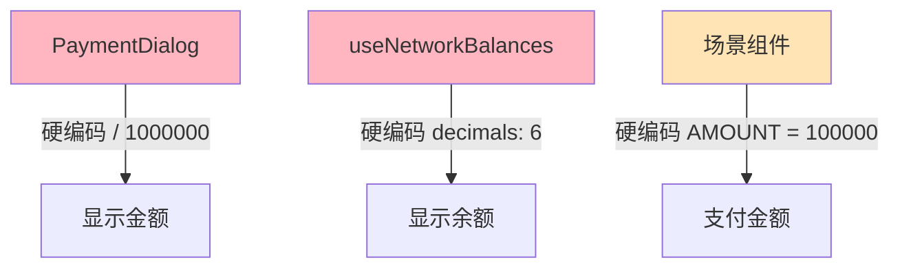
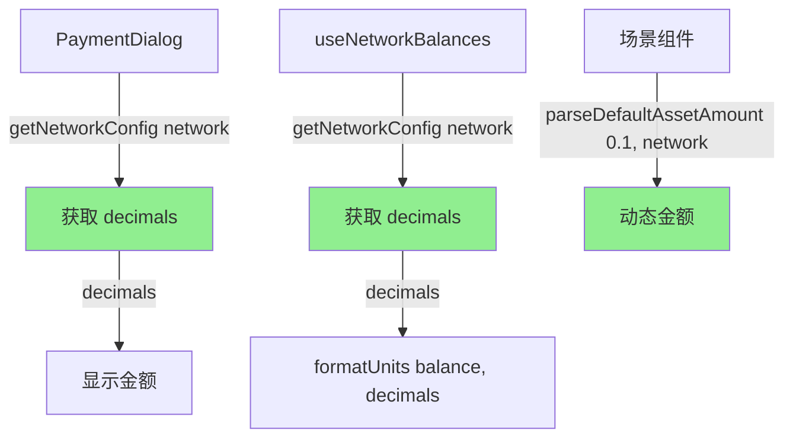

# Examples/Showcase Decimals 硬编码分析

## 概述

本文档分析 `examples/showcase/` 项目中对 `decimals = 6` 的硬编码情况，评估对 BSC Wrapped USDT 的影响。

## 项目结构

```
examples/showcase/
├── client/           # React 前端应用
│   └── src/
│       ├── components/   # UI 组件
│       ├── hooks/        # React hooks
│       ├── scenarios/    # 场景示例
│       ├── code-examples/ # 代码示例
│       └── config.ts     # 配置文件
└── server/           # Express 后端服务
    └── src/
```

## 硬编码位置汇总

### 🔴 真实硬编码（需要修复）

| 文件 | 行数 | 代码 | 类型 | 影响 |
|------|------|------|------|------|
| **`client/src/components/PaymentDialog.tsx`** | 372 | `/ 1000000` | 🔴 显示转换 | 高 |
| **`client/src/components/PaymentDialog.tsx`** | 388 | `/ 1000000` | 🔴 显示转换 | 高 |
| **`client/src/components/PaymentDialog.tsx`** | 407 | `/ 1000000` | 🔴 显示转换 | 高 |
| **`client/src/hooks/useNetworkBalances.ts`** | 133 | `formatUnits(balance, 6)` | 🔴 余额显示 | 高 |

### ⚠️ 示例数据（建议改进）

| 文件 | 行数 | 代码 | 类型 | 影响 |
|------|------|------|------|------|
| **`client/src/scenarios/ServerlessSplitPayment.tsx`** | 27 | `AMOUNT = "100000"` | ⚠️ 示例金额 | 中 |
| **`client/src/scenarios/ServerlessPointsReward.tsx`** | 23 | `AMOUNT = "100000"` | ⚠️ 示例金额 | 中 |
| **`client/src/scenarios/ServerlessRandomNFT.tsx`** | 23 | `AMOUNT = "100000"` | ⚠️ 示例金额 | 中 |
| **`client/src/code-examples/premium-download-server.ts`** | 18 | `"100000"` | ⚠️ 示例金额 | 中 |
| **`client/src/code-examples/nft-mint.ts`** | 26 | `"100000"` | ⚠️ 示例金额 | 中 |
| **`client/src/code-examples/points-reward.ts`** | 26 | `"100000"` | ⚠️ 示例金额 | 中 |
| **`client/src/code-examples/split-payment.ts`** | 21 | `"100000"` | ⚠️ 示例金额 | 中 |

### ✅ 仅注释（无影响）

| 文件 | 说明 |
|------|------|
| **`client/src/hooks/useRewardTokenData.ts`** | 注释："Formatted with decimals" |
| **`client/src/hooks/useX402Execute.ts`** | 示例注释：`amount: '1000000'` |
| **`README.md`** | 文档说明："0.1 USDC = 100,000 (6 decimals)" |

---

## 详细分析

### 🔴 关键问题 1：PaymentDialog 中的金额显示（最严重）

**文件**: `client/src/components/PaymentDialog.tsx`

**问题代码**:
```typescript
// 第 372 行
{(parseFloat(paymentRequirements.extra.businessAmount) / 1000000).toFixed(6)} {currency}

// 第 388 行
{(parseFloat(paymentRequirements.extra.facilitatorFee) / 1000000).toFixed(6)} {currency}

// 第 407 行
{(parseFloat(paymentRequirements.maxAmountRequired) / 1000000).toFixed(6)} {currency}
```

**问题**：
- 🔴 **硬编码 `1000000` (10^6)** 用于将 atomic units 转换为显示单位
- 🔴 **假设所有网络的 token decimals = 6**
- 🔴 如果 BSC Wrapped USDT decimals ≠ 6，**显示金额会错误**

**影响场景**：

| BSC decimals | Actual Amount | 显示金额 | 问题 |
|--------------|---------------|----------|------|
| **6** ✅ | 100000 | 0.1 USDC | ✅ 正确 |
| **18** 🔴 | 100000 | 0.1 USDC | ❌ 实际是 0.0000000000001，显示错误 10^12 倍！ |
| **8** 🔴 | 100000 | 0.1 USDC | ❌ 实际是 0.001，显示错误 100 倍 |

**用户体验影响**：
- ❌ 用户看到**错误的支付金额**
- ❌ Business Amount、Facilitator Fee、Total Amount **全部显示错误**
- ❌ 严重的信任问题和用户困惑

**严重程度**: 🔴 **P0 - 致命**

---

### 🔴 关键问题 2：余额显示错误

**文件**: `client/src/hooks/useNetworkBalances.ts`

**问题代码**:
```typescript
// 第 133 行
return {
  network,
  balance: formatUnits(balance, 6), // ❌ USDC has 6 decimals
  raw: balance,
  loading: false,
  error: null,
};
```

**问题**：
- 🔴 **硬编码 `decimals: 6`** 用于格式化余额
- 🔴 如果 BSC Wrapped USDT decimals ≠ 6，**余额显示错误**

**影响场景**：

| BSC decimals | Raw Balance | 显示余额 | 问题 |
|--------------|-------------|----------|------|
| **6** ✅ | 1000000 | 1.0 USDC | ✅ 正确 |
| **18** 🔴 | 1000000000000000000 | 1.0 USDC | ❌ 实际应该是 1.0，但代码假设是 6 decimals |
| **18** 🔴 | 1000000 | 0.000000000001 | ❌ 显示极小值，用户困惑 |

**用户体验影响**：
- ❌ 用户看到**错误的钱包余额**
- ❌ 可能误以为没有足够的余额支付
- ❌ 或者误以为有大量余额（如果 decimals > 6）

**严重程度**: 🔴 **P0 - 致命**

---

### ⚠️ 一般问题：示例金额硬编码

**文件**: 多个场景和示例文件

**问题代码**:
```typescript
// ServerlessSplitPayment.tsx:27
const AMOUNT = "100000"; // 0.1 USDC (6 decimals)

// ServerlessPointsReward.tsx:23
const AMOUNT = "100000"; // 0.1 USDC (6 decimals)

// ServerlessRandomNFT.tsx:23
const AMOUNT = "100000"; // 0.1 USDC (6 decimals)

// code-examples/*.ts
amount: "100000", // 0.1 USDC (6 decimals)
```

**问题**：
- ⚠️ 硬编码示例金额为 `"100000"`
- ⚠️ 注释假设 "0.1 USDC (6 decimals)"
- ⚠️ 如果 BSC decimals ≠ 6，示例金额不再代表 0.1 token

**影响场景**：

| BSC decimals | 硬编码 Amount | 实际价值 | 问题 |
|--------------|---------------|----------|------|
| **6** ✅ | "100000" | 0.1 USDC | ✅ 符合预期 |
| **18** 🔴 | "100000" | 0.0000000000001 USDT | ❌ 几乎为 0，无意义 |
| **8** 🔴 | "100000" | 0.001 USDT | ❌ 远小于预期的 0.1 |

**用户体验影响**：
- ⚠️ 示例交易可能因**金额过小而失败**
- ⚠️ 或者因**金额与预期不符**而困惑
- ⚠️ Hook 逻辑可能因金额太小而无法正常工作（如 NFT mint 需要最小金额）

**严重程度**: ⚠️ **P1 - 重要**

---

### ✅ 无影响：Reward Token 的 decimals

**文件**: `client/src/hooks/useRewardTokenData.ts`

**代码**:
```typescript
// 第 156-158 行
userBalance: formatUnits(userBalanceRaw, 18),       // ✅ Reward token 固定 18 decimals
contractBalance: formatUnits(remainingRewardsRaw, 18), // ✅ Reward token 固定 18 decimals
totalSupply: formatUnits(totalSupplyRaw, 18),       // ✅ Reward token 固定 18 decimals
```

**说明**：
- ✅ Reward Token 是**独立的 ERC20 代币**，固定 18 decimals
- ✅ 与支付 token (USDC/USDTx) 无关
- ✅ **无需修改**

---

## 架构分析

### 当前架构问题



**问题**：
- 🔴 所有转换逻辑都**假设 decimals = 6**
- 🔴 没有从网络配置动态获取 decimals
- 🔴 切换到 BSC 后，显示会完全错误

---

### 正确架构



**改进**：
- ✅ 从 `@x402x/core` 动态获取 decimals
- ✅ 使用 `parseDefaultAssetAmount()` 和 `formatDefaultAssetAmount()`
- ✅ 自动适配所有网络

---

## 解决方案

### 方案 1：修复 PaymentDialog（推荐）⭐

**修改文件**: `client/src/components/PaymentDialog.tsx`

#### 当前代码（错误）：

```typescript
// ❌ 硬编码 1000000
{(parseFloat(paymentRequirements.extra.businessAmount) / 1000000).toFixed(6)} {currency}
{(parseFloat(paymentRequirements.extra.facilitatorFee) / 1000000).toFixed(6)} {currency}
{(parseFloat(paymentRequirements.maxAmountRequired) / 1000000).toFixed(6)} {currency}
```

#### 修复方案 A：使用 @x402x/core 工具函数

```typescript
import { formatDefaultAssetAmount, getNetworkConfig } from '@x402x/core';

// ✅ 动态获取 decimals 并格式化
const networkConfig = getNetworkConfig(paymentRequirements.network);
const businessAmountFormatted = formatDefaultAssetAmount(
  paymentRequirements.extra.businessAmount,
  paymentRequirements.network
);
const facilitatorFeeFormatted = formatDefaultAssetAmount(
  paymentRequirements.extra.facilitatorFee,
  paymentRequirements.network
);
const totalAmountFormatted = formatDefaultAssetAmount(
  paymentRequirements.maxAmountRequired,
  paymentRequirements.network
);

// 在 JSX 中使用
<span>Business Amount:</span>
<strong>{businessAmountFormatted} {currency}</strong>

<span>Facilitator Fee:</span>
<strong>{facilitatorFeeFormatted} {currency}</strong>

<span>Total Amount:</span>
<strong>{totalAmountFormatted} {currency}</strong>
```

#### 修复方案 B：使用 viem 的 formatUnits

```typescript
import { formatUnits } from 'viem';
import { getNetworkConfig } from '@x402x/core';

// ✅ 动态获取 decimals
const networkConfig = getNetworkConfig(paymentRequirements.network);
const decimals = networkConfig.defaultAsset.decimals;

// 在 JSX 中使用
<span>Business Amount:</span>
<strong>
  {formatUnits(BigInt(paymentRequirements.extra.businessAmount), decimals)} {currency}
</strong>

<span>Facilitator Fee:</span>
<strong>
  {formatUnits(BigInt(paymentRequirements.extra.facilitatorFee), decimals)} {currency}
</strong>

<span>Total Amount:</span>
<strong>
  {formatUnits(BigInt(paymentRequirements.maxAmountRequired), decimals)} {currency}
</strong>
```

**推荐**: 方案 A（使用 `@x402x/core` 工具函数）
- ✅ 更简洁
- ✅ 与 SDK 保持一致
- ✅ 自动处理字符串转换

---

### 方案 2：修复 useNetworkBalances（推荐）⭐

**修改文件**: `client/src/hooks/useNetworkBalances.ts`

#### 当前代码（错误）：

```typescript
// ❌ 硬编码 decimals: 6
return {
  network,
  balance: formatUnits(balance, 6), // USDC has 6 decimals
  raw: balance,
  loading: false,
  error: null,
};
```

#### 修复代码：

```typescript
import { getNetworkConfig } from '@x402x/core';

// ✅ 动态获取 decimals
const networkConfig = getNetworkConfig(network);
const decimals = networkConfig.defaultAsset.decimals;

return {
  network,
  balance: formatUnits(balance, decimals), // ✅ 使用动态 decimals
  raw: balance,
  loading: false,
  error: null,
};
```

---

### 方案 3：修复场景示例金额（推荐）⭐

**修改文件**: 
- `client/src/scenarios/ServerlessSplitPayment.tsx`
- `client/src/scenarios/ServerlessPointsReward.tsx`
- `client/src/scenarios/ServerlessRandomNFT.tsx`

#### 当前代码（不灵活）：

```typescript
// ❌ 硬编码 0.1 USDC (6 decimals)
const AMOUNT = "100000";
```

#### 修复方案 A：使用 parseDefaultAssetAmount（推荐）

```typescript
import { parseDefaultAssetAmount } from '@x402x/core';

// ✅ 在使用时动态计算（需要 network）
// 在组件中，根据选择的 network 计算
const preparePayment = (network: Network) => {
  const amount = parseDefaultAssetAmount('0.1', network); // ✅ 动态
  // ... use amount
};
```

#### 修复方案 B：使用网络感知的常量函数

```typescript
import { parseDefaultAssetAmount } from '@x402x/core';

// ✅ 工具函数
function getExampleAmount(network: Network): string {
  return parseDefaultAssetAmount('0.1', network);
}

// 在组件中使用
const preparePayment = (network: Network) => {
  const amount = getExampleAmount(network); // ✅ 动态
  // ... use amount
};
```

**推荐**: 方案 A
- ✅ 直接使用 SDK 函数
- ✅ 清晰表达意图（0.1 代表 0.1 USD）

---

### 方案 4：修复代码示例注释（可选）

**修改文件**: `client/src/code-examples/*.ts`

#### 当前注释：

```typescript
amount: "100000", // 0.1 USDC (6 decimals)
```

#### 改进注释：

```typescript
amount: "100000", // 0.1 token (atomic units, decimals vary by network)
```

或者使用动态代码：

```typescript
import { parseDefaultAssetAmount } from '@x402x/core';

// ✅ 动态计算，适配所有网络
const amount = parseDefaultAssetAmount('0.1', network);
```

---

## 实施计划

### 阶段 1：修复核心显示问题（P0 - 立即）

**时间**: 2-3 小时

1. **修复 PaymentDialog** ✅
   - 使用 `formatDefaultAssetAmount()` 或动态 decimals
   - 测试所有网络的显示

2. **修复 useNetworkBalances** ✅
   - 从 `getNetworkConfig()` 获取 decimals
   - 测试余额显示

**影响**: 修复所有金额和余额的显示错误

---

### 阶段 2：修复示例金额（P1 - 重要）

**时间**: 1-2 小时

1. **修改场景组件** ⚠️
   - ServerlessSplitPayment
   - ServerlessPointsReward
   - ServerlessRandomNFT
   - 使用 `parseDefaultAssetAmount('0.1', network)`

2. **更新代码示例** ⚠️
   - `code-examples/*.ts`
   - 使用动态金额或更新注释

**影响**: 确保示例在所有网络上正常工作

---

### 阶段 3：测试和验证（必需）

**时间**: 1-2 小时

1. **单元测试**
   - 测试金额转换逻辑
   - 测试不同 decimals 的场景

2. **集成测试**
   - 在 BSC Testnet 上完整测试
   - 验证显示金额正确
   - 验证支付流程正常

3. **回归测试**
   - 确保其他网络（Base, X Layer）仍正常工作

---

## 风险评估

### 如果 BSC Wrapped USDT decimals = 6 ✅

| 问题 | 当前影响 | 修复必要性 |
|------|----------|-----------|
| **PaymentDialog 显示** | ⚠️ 能显示但不规范 | ⭐⭐⭐ 建议修复 |
| **余额显示** | ⚠️ 能显示但不规范 | ⭐⭐⭐ 建议修复 |
| **示例金额** | ✅ 能正常工作 | ⭐⭐ 可选优化 |

**理由**: 虽然能工作，但代码质量差，不利于维护和扩展。

---

### 如果 BSC Wrapped USDT decimals ≠ 6 🔴

| 问题 | 当前影响 | 修复必要性 |
|------|----------|-----------|
| **PaymentDialog 显示** | 🔴 完全错误 | ⭐⭐⭐⭐⭐ 必须立即修复 |
| **余额显示** | 🔴 完全错误 | ⭐⭐⭐⭐⭐ 必须立即修复 |
| **示例金额** | 🔴 无法使用 | ⭐⭐⭐⭐ 必须修复 |

**理由**: 应用在 BSC 上完全无法使用。

---

## 验证步骤

### 第一步：验证 BSC Wrapped USDT decimals

```bash
# BSC Testnet
cast call 0xdac693b5f14e7ee5923a4830cd2f82ff178f5098 \
  "decimals()(uint8)" \
  --rpc-url https://data-seed-prebsc-1-s1.binance.org:8545

# BSC Mainnet
cast call 0x2fDb94bAa9D664a1879BEe1f944F5F5d2dad4451 \
  "decimals()(uint8)" \
  --rpc-url https://bsc-dataseed.binance.org
```

### 第二步：根据结果决定紧急程度

- **如果 decimals = 6**: 按正常节奏修复（1-2 周）
- **如果 decimals ≠ 6**: 立即修复（1-2 天）

---

## 代码质量建议

### 当前问题

```typescript
// ❌ 不良实践：硬编码 magic number
balance / 1000000

// ❌ 不良实践：硬编码 decimals
formatUnits(balance, 6)

// ❌ 不良实践：硬编码示例金额
const AMOUNT = "100000"; // 注释说明但仍硬编码
```

### 推荐实践

```typescript
// ✅ 最佳实践：使用 SDK 工具函数
import { formatDefaultAssetAmount, parseDefaultAssetAmount } from '@x402x/core';

// 格式化显示
const displayAmount = formatDefaultAssetAmount(atomicAmount, network);

// 解析输入
const atomicAmount = parseDefaultAssetAmount('0.1', network);

// ✅ 最佳实践：从配置获取 decimals
import { getNetworkConfig } from '@x402x/core';
const config = getNetworkConfig(network);
const decimals = config.defaultAsset.decimals;
```

---

## 总结

### 🔴 关键发现

1. **2 处致命硬编码**：
   - `PaymentDialog` 中 3 次 `/ 1000000`
   - `useNetworkBalances` 中 `formatUnits(..., 6)`

2. **7 处示例硬编码**：
   - 场景组件和代码示例中的 `AMOUNT = "100000"`

3. **影响程度取决于 BSC decimals**：
   - 如果 decimals = 6：能工作但代码质量差
   - 如果 decimals ≠ 6：完全无法使用

### ✅ 解决方案简单

1. **使用 `@x402x/core` 工具函数**：
   - `formatDefaultAssetAmount()` - 格式化显示
   - `parseDefaultAssetAmount()` - 解析金额
   - `getNetworkConfig()` - 获取配置

2. **预计修复时间**：
   - P0 问题：2-3 小时
   - P1 问题：1-2 小时
   - 测试验证：1-2 小时
   - **总计：4-7 小时**

### 🎯 推荐行动

1. **立即验证** BSC Wrapped USDT 的 decimals（5 分钟）
2. **根据结果决定紧急程度**
3. **实施修复**（4-7 小时）
4. **彻底测试**，确保所有网络正常

**关键优先级**: 无论 decimals 是否为 6，都**建议修复**以提高代码质量和可维护性。
