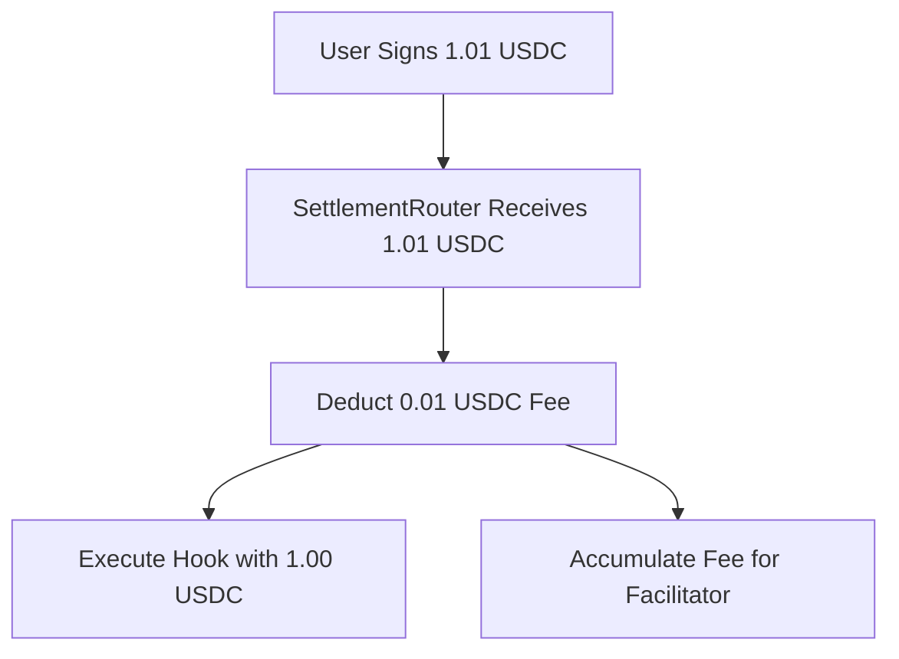

Facilitator fees are small payments to facilitator services that cover the cost of executing your transactions on-chain. This enables truly permissionless facilitators to operate profitably while providing reliable settlement services.

## Overview

In the x402x protocol, facilitator fees serve several important purposes:

- **Cover gas costs**: Pay for blockchain transaction execution
- **Ensure profitability**: Allow facilitators to operate sustainably
- **Enable permissionless operation**: Anyone can run a facilitator service
- **Provide reliability**: Well-funded facilitators maintain high uptime

## How It Works

### 1. Fee Calculation

Facilitators dynamically calculate minimum fees based on:

- **Current gas prices**: Real-time network conditions
- **Hook complexity**: Gas usage of your settlement logic
- **Safety margins**: Buffer for gas price fluctuations
- **Profit margin**: Ensures facilitator profitability

### 2. Total Payment Amount

When you make a payment, the total amount includes:

```
Total Signed = Business Amount + Facilitator Fee
```

For example:
- Business amount: 1.00 USDC
- Facilitator fee: 0.01 USDC
- **Total signed**: 1.01 USDC

### 3. Fee Deduction Flow

1. **User signs**: Authorizes total amount (business + fee)
2. **SettlementRouter receives**: Full authorized amount
3. **Fee deduction**: Router deducts facilitator fee
4. **Hook execution**: Business amount passed to your Hook
5. **Fee accumulation**: Fees stored for later facilitator claims



## Client Usage

### Automatic Fee Query (Recommended)

The client automatically queries and includes the minimum facilitator fee:

```typescript
import { x402xClient } from "@x402x/client";

const client = new x402xClient({
  wallet,
  network: "base-sepolia",
  facilitatorUrl: "https://facilitator.x402x.dev",
});

// Client automatically queries and adds fee
const result = await client.execute({
  amount: "1000000",  // Business amount: 1.00 USDC
  payTo: "0xMerchant...",
});
// Total signed: 1.00 + fee (e.g., 1.01 USDC)
// Hook receives: 1.00 USDC net
```

### Manual Fee Specification

For consistent UX, you can query and specify fees explicitly:

```typescript
import { x402xClient, TransferHook } from "@x402x/client";

// Query current fee
const feeResult = await client.calculateFee(
  TransferHook.getAddress("base-sepolia"),
  TransferHook.encode()
);

console.log(`Current fee: ${feeResult.facilitatorFee} (${feeResult.facilitatorFeeUSD} USD)`);

// Use specific fee amount
const result = await client.execute({
  amount: "1000000",     // Business amount: 1.00 USDC
  facilitatorFee: feeResult.facilitatorFee,
  payTo: "0xMerchant...",
});
```

### Fee Query API

You can also query fees directly for integration planning:

```typescript
const feeResult = await client.calculateFee(
  "0xHookAddress",
  "0xHookData"
);

console.log({
  network: feeResult.network,
  hook: feeResult.hook,
  hookAllowed: feeResult.hookAllowed,
  facilitatorFee: feeResult.facilitatorFee,      // Atomic units
  facilitatorFeeUSD: feeResult.facilitatorFeeUSD, // USD value
  validitySeconds: feeResult.validitySeconds,     // Cache duration
});
```

## Server Usage

### Automatic Fee Query

Server middlewares can automatically query fees:

```typescript
// Hono middleware
app.use("/api/*", paymentMiddleware(
  "0xMerchant",
  {
    price: "$0.10",           // Business price
    network: "base-sepolia",
    facilitatorFee: "auto",   // Query minimum fee automatically
  },
  { url: facilitatorUrl }
));
// Total price shown to user: $0.10 + fee
```

### Static Fee Configuration

For predictable pricing, set fees explicitly:

```typescript
app.use("/api/*", paymentMiddleware(
  "0xMerchant",
  {
    price: "$0.10",           // Business price
    network: "base-sepolia",
    facilitatorFee: "$0.01",  // Fixed fee in USD
  },
  { url: facilitatorUrl }
));
// Total price: $0.11 (fixed)
```

### Fee Query Endpoint

Servers can query fees directly from facilitators:

```typescript
// Query minimum facilitator fee
const response = await fetch(
  `${facilitatorUrl}/calculate-fee?network=base-sepolia&hook=${hookAddress}&hookData=${hookData}`
);
const feeResult = await response.json();

// Use in PaymentRequirements
const paymentRequirements = {
  maxAmountRequired: calculateTotal(businessPrice, feeResult.facilitatorFee),
  // ... other fields
  extra: {
    facilitatorFee: feeResult.facilitatorFee,
    // ... other settlement fields
  }
};
```

### Best Practices

- **Use automatic queries** for most applications (handles gas price changes)
- **Query fees close to payment time** to ensure accuracy

import { RelatedLinks } from "@/components/docs/related-links";

## Related Docs

<RelatedLinks
  items={[
    {
      title: "Facilitator Fee API",
      href: "https://github.com/nuwa-protocol/x402-exec/blob/main/facilitator/README.md#facilitator-fee-validation",
      description: "Detailed fee calculation and validation mechanisms.",
    },
    {
      title: "Client Guide",
      href: "./client-guide.mdx",
      description: "How clients work with facilitator fees.",
    },
    {
      title: "Server Guide",
      href: "./server-guide.mdx",
      description: "How servers handle facilitator fees in middlewares.",
    },
  ]}
/>
